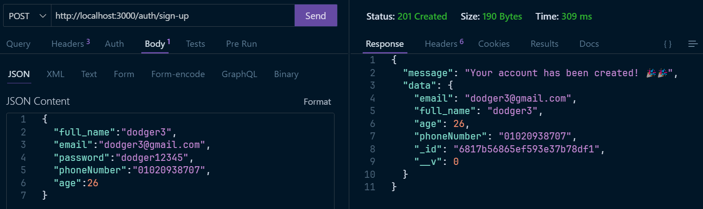
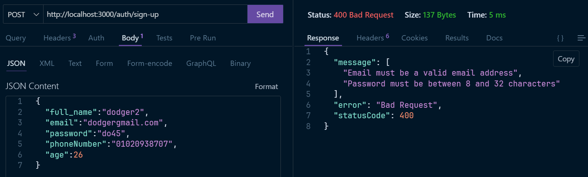
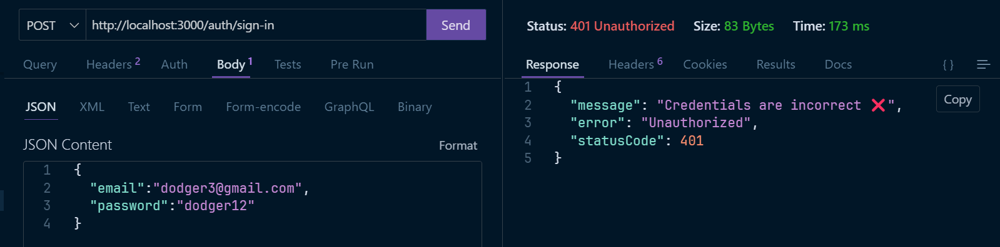
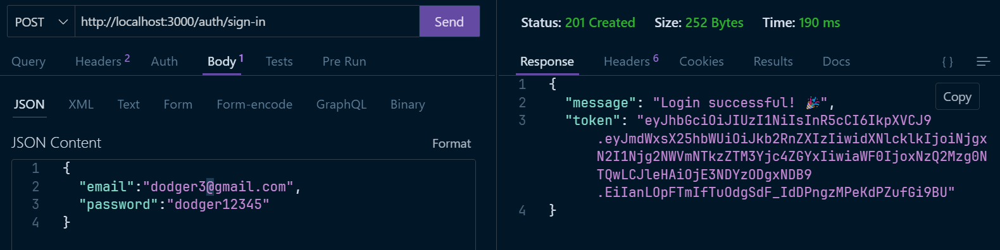
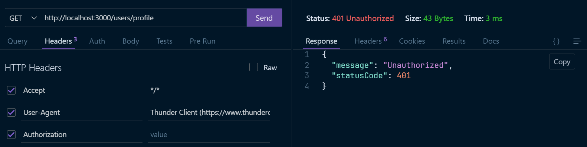
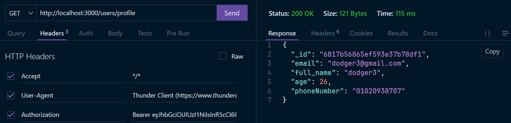
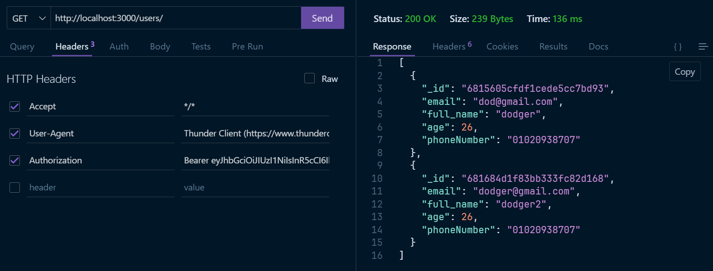
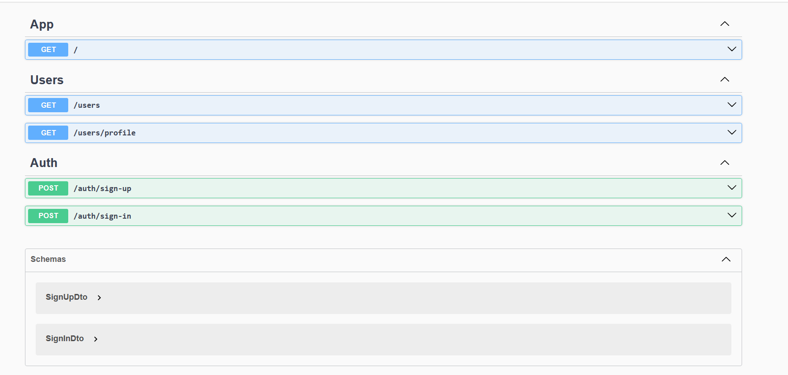

  

[circleci-image]: https://img.shields.io/circleci/build/github/nestjs/nest/master?token=abc123def456
[circleci-url]: https://circleci.com/gh/nestjs/nest

A progressive <a href="http://nodejs.org" target="_blank">Node.js</a> framework for building efficient and scalable server-side applications.

  
  
  
  
  
  
  
  
  
  

## Description

This project is a **NestJS-based backend** application designed for building a scalable and efficient user authentication system. It includes functionality for user sign-up, sign-in, and user management with basic features such as profile retrieval and listing of other users.

It uses **JWT (JSON Web Token)** for securing API endpoints and is equipped with a validation system using `class-validator` to ensure that input data is in the correct format.

The project also includes **Swagger API documentation** for easy interaction with the backend through an intuitive UI.

### Features:
- User Registration (Sign-up)
- User Authentication (Sign-in)
- JWT Authentication
- User Profile Management
- Data Validation using `class-validator`
- Scalable and extensible structure
- Swagger UI for interactive API documentation

## UI Examples

Below are some UI examples to demonstrate how the application interacts with the user:
### 1. **Signup Conflict**
   - **Description**: This screenshot shows an error when a user tries to sign up with an email that's already registered in the system.
   - 

### 2. **Successful Signup**
   - **Description**: This screenshot shows the successful creation of a user account during the signup process.
   - 

### 3. **SignUp DTO Validation**
   - **Description**: This screenshot shows the validation error when a user tries to sign up with invalid data. The API returns an error due to improper request formatting.
   - 

### 4. **Signin with Incorrect Credentials**
   - **Description**: This screenshot demonstrates an invalid login attempt with incorrect credentials, resulting in an error message.
   - 

### 5. **Successful Signin**
   - **Description**: This screenshot shows a successful login where the user is authenticated and granted access to the system.
   - 

### 6. **Unauthorized Access**
   - **Description**: This screenshot demonstrates an error message that appears when trying to access a protected route without proper authorization (e.g., missing or invalid token).
   - 

### 7. **Profile Request Success**
   - **Description**: This screenshot shows a successful request for fetching the user's profile information.
   - 

### 8. **Get All Users (Excluding Current User)**
   - **Description**: This screenshot shows the list of all users retrieved from the system, excluding the current user.
   - 

### 9. **Swagger Documentation**
   - **Description**: This screenshot shows the interactive Swagger UI for exploring the available API endpoints, testing requests, and understanding the API structure.
   - 
